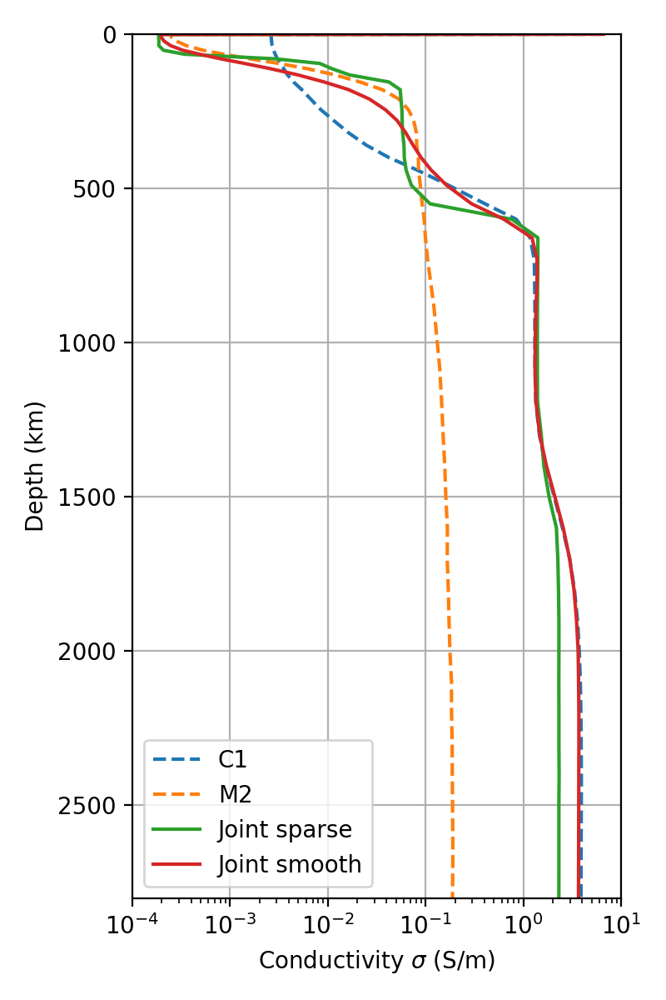
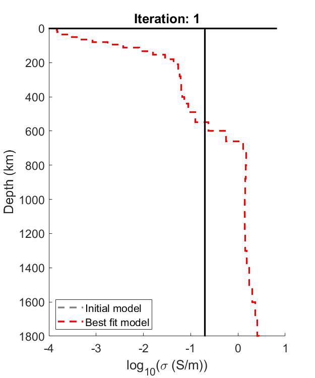

# Electrical conductivity profile of the mantle

This repo provides radial electrical conductivity profiles that were obtained through a PDE-constrained non-linear optimization of magnetic field measurements from the [CHAMP](https://directory.eoportal.org/web/eoportal/satellite-missions/c-missions/champ) and [Swarm](https://earth.esa.int/web/guest/missions/esa-operational-eo-missions/swarm) satellites. These models were presented in this work (accepted [manuscript](Manuscript.pdf) can also be found in this repository)

> Grayver, A. V., Munch, F. D., Kuvshinov, A. V., Khan, A., Sabaka, T. J., & Tøffner‐Clausen, L. (2017). Joint inversion of satellite‐detected tidal and magnetospheric signals constrains electrical conductivity and water content of the upper mantle and transition zone. Geophysical research letters, 44(12), 6074-6081.
> https://doi.org/10.1002/2017GL073446

Please reference this publication if you use the provided models in your work.

## Radial conductivity profiles

This image was created by executing the `plot_models.py` script.

## Inversion progress

The animation below shows best model at each iteration of the optimization for the case of the joint inversion. Starting (gray -- constant profile of 0.2 S/m) and final (red) models are denoted by dashed lines.

